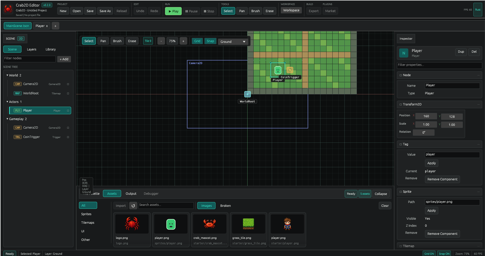

# Crab2D

A modular 2D game engine and visual editor written in Rust. Designed to be approachable for beginners while remaining capable enough for real projects.

> **Current version: v0.2.0** — actively developed. APIs may change between releases.

## Editor Preview



*The editor showing a starter scene: scene tree on the left, viewport with tilemap and entities in the center, asset browser at the bottom, and inspector on the right.*

## What is Crab2D?

Crab2D is a self-contained 2D game engine with an integrated visual editor, similar in concept to Godot but written entirely in Rust. You create scenes visually, place entities with components (sprite, physics, collision, script…), paint tilemaps, and hit **Play** to test your game — all inside the same tool.

The engine is split into small focused crates so you can embed only what you need, and the editor is built on [egui](https://github.com/emilk/egui)/[eframe](https://github.com/emilk/egui) for native cross-platform rendering.

## Features

### Editor

| Feature | Description |
|---|---|
| Scene hierarchy | Node tree with create, rename, duplicate, delete, and group |
| Inspector | Per-component property panels (Transform, Sprite, Camera, Collider, Physics, Audio, Animation, UI, Particles, Script, Tag) |
| Tilemap painter | Brush / Erase / Select modes, solid and sensor tiles, multiple layers, grid snapping |
| Asset browser | Directory scan with UUID tracking, filter by type (sprites, tilemaps, UI, other), broken asset detection |
| Multi-scene tabs | Open multiple scenes in tabs, dirty-state tracking per tab |
| Gameplay presets | No-code presets: top-down player, wall, collectible, door |
| Viewport controls | Pan, zoom, grid overlay, snap-to-grid, layer selector |
| Run workflow | Play / Pause / Stop with real project files, auto-save before run |
| Dockable panels | Scene, Assets, Output, and Debugger panels can be docked or floated |
| Undo / Redo | Full command history for all editor operations |

### Runtime

| Feature | Description |
|---|---|
| Physics | AABB collision, one-way platforms, per-entity gravity scale, terminal velocity |
| Collision layers | Bitfield-based `collision_layer` and `collision_mask` for selective collisions |
| Player controller | WASD / arrow keys driven movement |
| Camera | Follow with configurable smoothing, zoom |
| Triggers | Named sensor events delivered to Rhai scripts |
| Animation | Spritesheet states with per-state FPS |
| Particles | Spawn rate, color lerp, size lerp, spread cone, gravity |
| In-game UI | Labels and panels anchored to screen corners |
| Scene manager | `load_scene`, `push_scene`, `pop_scene` with a scene stack |
| Save system | Per-slot JSON saves (`saves/save_00.json`) |
| Scripting | Behavior scripts via [Rhai](https://rhai.rs) — `on_start`, `on_update`, `on_trigger` |
| Audio | WAV / OGG playback via rodio with looping and auto-play |

### Asset Pipeline

- UUID-based `AssetHandle<T>` with `.meta` sidecar concept
- `AssetRegistry` with directory scan and path resolution
- Kind detection by file extension (image, audio, script, scene, font)

## Quick Start

```bash
# Clone the repo
git clone <repo-url>
cd Crab2D

# Run the editor
cargo run -p crab2d-editor-app

# Run a saved project headlessly
cargo run -p crab2d-runtime-app -- project.crab2d.json

# Save the starter project to disk from the editor
cargo run -p crab2d-editor-app -- --save-starter-project
```

> **Linux note:** rodio requires ALSA dev headers.
> Install with `sudo apt-get install libasound2-dev` before building.

## Workspace Layout

```
apps/
  crab2d-editor/        # editor executable (egui/eframe)
  crab2d-runtime/       # runtime executable for saved projects
crates/
  crab2d-core/          # engine tick, runtime systems, scripting, audio, particles
  crab2d-editor/        # editor state, commands, inspector, document workflow
  crab2d-platform/      # input, headless shell, OS integration
  crab2d-render/        # render list abstraction and null renderer
  crab2d-scene/         # scene graph, components, transforms
  crab2d-assets/        # typed asset registry and handles
  crab2d-procgen/       # procedural world generators
  crab2d-plugin-api/    # stable API boundary for plugins
```

## Project File

Projects are saved as `project.crab2d.json` and contain:

- `ProjectInfo` — name, version
- `AssetRegistry` — registered asset paths and UUIDs
- Active `Scene` — nodes, transforms, all components

Scene files can be loaded standalone by the runtime or pushed/popped at runtime via the scene manager.

## Script API (Rhai)

Attach a `BehaviorComponent` to any node pointing to a `.rhai` file. The engine calls your functions each frame:

```javascript
// Globals available every frame:
//   entity_id, pos_x, pos_y, vel_x, vel_y, tag, dt
// Write-back globals (engine reads these after each call):
//   set_vel_x, set_vel_y, set_pos_x, set_pos_y, destroy, load_scene

fn on_start() {
    print(`entity ${entity_id} ready at (${pos_x}, ${pos_y})`);
}

fn on_update(dt) {
    if vel_y < -800.0 {
        set_vel_y = -800.0;
    }
}

fn on_trigger(name) {
    if name == "coin" {
        destroy = true;
    }
}
```

## Scene Manager

```rust
// From a script or runtime system:
scene_manager.load_scene("levels/level2.json");  // replace current scene
scene_manager.push_scene("ui/pause_menu.json");  // stack push
scene_manager.pop_scene();                        // return to previous
```

## Save System

```rust
let mut data = save.load(0)?;        // load slot 0
data.set_int("coins", 42);
data.set_bool("boss_defeated", true);
save.save(0, &data)?;                // persist slot 0
```

## Procedural Generation

```rust
use crab2d_procgen::{GenerationSettings, StarterVillageGenerator, WorldGenerator};

let scene = StarterVillageGenerator.generate_scene(&GenerationSettings {
    scene_name: "World".into(),
    map_width: 64,
    map_height: 48,
    tile_size: 32,
    seed: Some(42),
});
```

## Component Reference

| Component | Crate | Purpose |
|---|---|---|
| `Transform2D` | scene | Position, rotation, scale |
| `SpriteComponent` | scene | Texture path, z-index, tint, visibility |
| `Camera2DComponent` | scene | Zoom, clear color |
| `CameraFollowComponent` | scene | Smooth camera tracking with configurable lag |
| `Velocity2DComponent` | scene | Linear velocity |
| `Collider2DComponent` | scene | AABB, layer/mask, one-way flag, gravity scale |
| `PlayerControllerComponent` | scene | Keyboard-driven movement (WASD / arrows) |
| `TriggerComponent` | scene | Named sensor events |
| `TilemapComponent` | scene | Grid map with solid and sensor tiles |
| `AnimationComponent` | scene | Spritesheet states and per-state FPS |
| `AudioComponent` | scene | Clip path, volume, loop, auto-play |
| `BehaviorComponent` | scene | Rhai script path |
| `UiLabelComponent` | scene | Screen-space text with screen-corner anchor |
| `UiPanelComponent` | scene | Screen-space colored rectangle |
| `ParticleEmitterComponent` | scene | Spawn rate, color/size over lifetime, gravity |
| `PhysicsSettings` | scene | Scene-level gravity and terminal velocity |

## Quality Checks

```bash
cargo fmt --all
cargo test --workspace
cargo clippy --workspace --all-targets -- -D warnings
```

CI runs the same checks on every push to `main`.

## Documentation

| File | Contents |
|---|---|
| [`docs/ARCHITECTURE.md`](docs/ARCHITECTURE.md) | Crate responsibilities, dependency graph, module table for `crab2d-core`, project file format |
| [`docs/COMPONENTS.md`](docs/COMPONENTS.md) | Field tables for every component, storage layout, design rules for adding new types |
| [`docs/BEHAVIOR_SYSTEM_ROADMAP.md`](docs/BEHAVIOR_SYSTEM_ROADMAP.md) | No-code presets, Rhai script API reference, AI boundary design |
| [`docs/PROJECT_PHILOSOPHY.md`](docs/PROJECT_PHILOSOPHY.md) | Product principles — why decisions are made the way they are |
| [`docs/RUNTIME_MVP.md`](docs/RUNTIME_MVP.md) | Original minimal runtime loop design |
| [`docs/TILEMAP_AND_ASSET_BROWSER.md`](docs/TILEMAP_AND_ASSET_BROWSER.md) | Tilemap painter and asset browser implementation notes |
| [`docs/DEVELOPMENT_LOG.md`](docs/DEVELOPMENT_LOG.md) | Chronological record of what was built and why |

## License

MIT — see [LICENSE-MIT](LICENSE-MIT).
